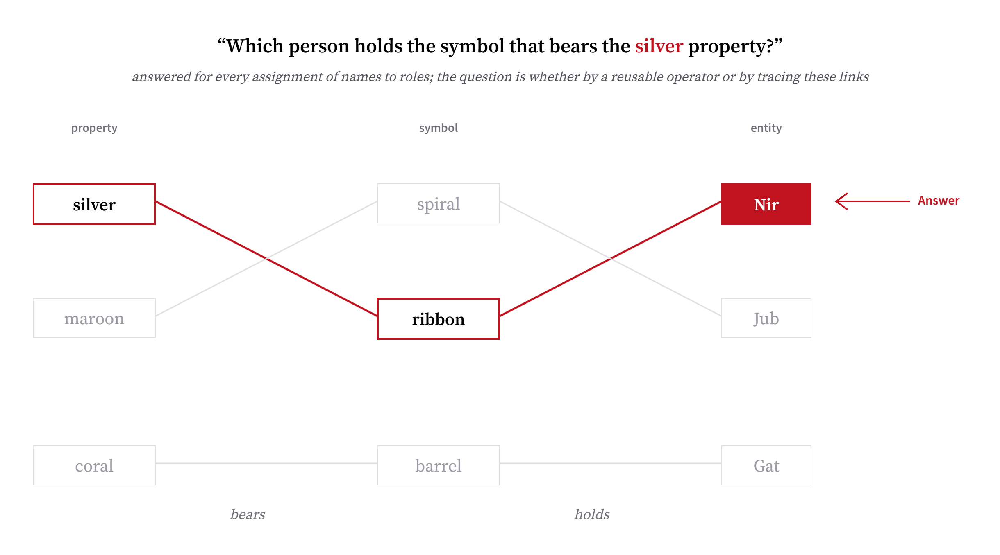
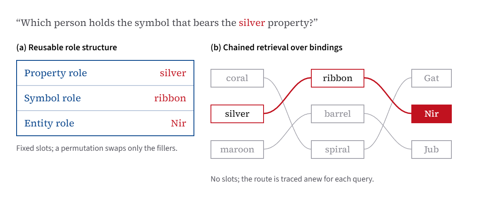
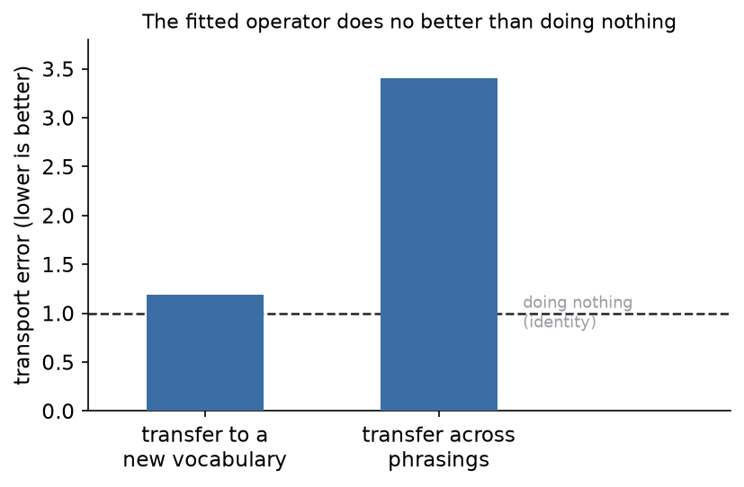
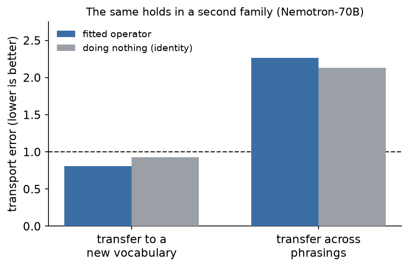

# Investigating the Possibility of a Reusable Role Operator in LLMs

*By Justas Miliauskas*



*Example question from the task: it requires two retrieval steps, from the relevant property to its
symbol and then to the entity that holds it. The other associations are irrelevant, and do not impact
performance in sufficiently large models.*

## The hypothesis

A sufficiently capable LLM can take a fact block that assigns several interchangeable entities to
roles, answer a question utilizing those, and remains consistently correct under permutation of the
question. You might then posit that this could be achieved by manipulating an abstract role algebra:
some sort of reusable representation of the group of permutations that would act the same way no
matter which entity sat in which slot. My goal was to try and see if it could be true.

Let me elaborate on the two possibilities. 1) Suppose we let a group element permute the entities
filling each role, and that a model's activation during a question is a vector at some position and
layer. Under one possibility, there might be a fixed linear operator for each group element (and it
would not depend on the specifics of the problem, the phrasing, or the vocabulary), that is capable
of mapping the activation of one assignment into the activation of a permuted one. The whole family
of operators would obey group laws, and would form a representation that is used in many tasks. 2)
Or, such an object does not exist, and each task simply has its own associations that the models
chains retrievals for to answer correctly.



*The two mechanisms this work distinguishes.*

Smaller models, like Qwen 7B, cannot perform representative tasks correctly. Larger, yet not
prohibitively so, models like Qwen 72B are quite robust, performing the task with 100% accuracy. They
thus might possess such a tool, making them suitable for investigation.

## Calibration

In order to make sure the method I was using was truly capable of detecting the representation I was
looking for, I verified it on a few known cases.

I built a few small synthetic transformer-architecture organisms whose internals were known by
construction: one with a role representation, one with only a shared-symbol representation, one with
only retrieval, and one that is only position-based. The detector indeed correctly classified all of
them, proving its reliability at least thus far.

## The instrument / test

For an activation from a question and one from a permuted variant, I fit an
unconstrained linear operator using ridge regression at each layer and position. For a group element
$g$, it's a map that best correlates the activation of a task $h(x)$ to the activation of its
permutation version $h(g\cdot x)$:

$$R_g = \arg\min_{R}\ \sum_{x}\lVert R\,h(x) - h(g\cdot x)\rVert^2 + \lambda\lVert R\rVert_F^2 .$$

The operator is not constrained to force permutation. The fitted operator is then scored against a list of conditions: whether it transfers
to a novel vocabulary, whether it transfers to different phrasings, whether it obeys the group laws,
whether it is causal, and whether it preserves the rest of the episode. Failing these conditions
points strongly to the model using a retrieval mechanism.

Each transfer condition is measured with a relative transport error, using held-out pairs the operator was not
fit on,

$$\mathrm{err}(R_g) = \frac{\sum_{x}\lVert R_g\,h(x) - h(g\cdot x)\rVert^2}{\sum_{x}\lVert h(g\cdot x) - h(x)\rVert^2},$$

the identity map, leaving the activation unchanged, scores exactly 1. The baseline the
fitted operator had to beat was thus an identity-fit ridge: anything at or above 1 was no better than just doing nothing.

## The main result

The model used for testing was Qwen2.5-72B-Instruct. It passed the capability tests fully on all
phrasings and vocabularies, making it a suitable candidate for holding a reusable representation.

At the answer position, the fitted operator could not be distinguished from the identity-fit ridge on
any measures. Transfer across unseen vocabulary was 1.186 versus the identity baseline of 1.211,
meaning applying the operator was worse than just changing nothing. Checking for the same reusability
across phrasing gave 3.407, entirely above the threshold. Verifying causality via patching gave 1.000
against 0.995 for identity, which means there's practically nothing causal about it.

<p align="center"></p>

*At the position of the answer, applying the fitted operator increases error in both conditions.
Similar failure across phrasings.*

## Checking other options

I also looked for an operator in a few other places. No probed position or layer succeeded in passing
the tests; no low-complexity non-linear map was found. I also checked the attention output and the
MLP output, neither of which had it.

<p align="center"></p>

*In another model family, the fitted operator also doesn't beat identity baseline.*

## A detour through small trained transformer models

I had a small detour trying to see whether a reusable role representation would even form in
increasingly favorable conditions (e.g. making memorization and shortcuts less and less feasible). It
turned out to be really difficult for them to even solve the simpler versions of role-binding tasks,
under a lot of different training hyperparameters. After a bit of thinking, I tried out training them
to be able to perform induction first. This pretraining allowed them to perform single hop thinking,
which was then sufficient to grok the problem.

The capable 128-dimensional models that were 500 times smaller also didn't have the role
representation found via detector, instead displaying signs of using retrieval chains. Even the
task most likely to reward an operator, requiring applying an inferred permutation to a new set, does
not form it. It seems that the linear operator is not discovered in the fitness space, and instead
the simpler retrieval chain is formed, consistent with degraded performance in more complicated
phrasing.

Even then, not a lot of seeds were successful, but of those that formed, none had a role representation,
even in the case where it would have been theoretically more generalizable and advantageous.

## Scope

The instrument only tests linear and low-complexity nonlinear maps. It only probed single positions
and single layers, so a representation spread across layers would not be found.

## Conclusion

Using an instrument validated against synthetic cases, I find that role-binding task capabilities in a
72B language model, replicating across model families, are implemented by associative retrieval rather
than a transportable role operator. The finding is the same using nonlinear maps, attention and MLP
outputs, and every position and layer probed. Looking at attention routing was not useful either.

## Reproduction

The instrument-validity result runs from the repository with no cached data:

```bash
python experiments/instrument/revalidate_instrument.py
```

The verdicts on the large model recompute from cached activations fetched from the compute volume;
the captures themselves need a GPU account and the model weights. The `experiments/` scripts produce
and analyze every number here, and `results/` holds the stored metrics.
